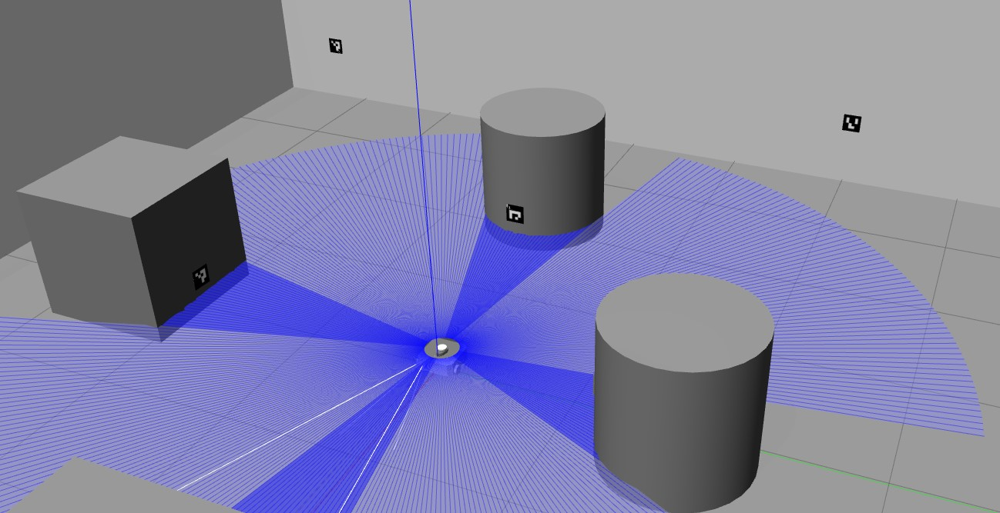

[](https://github.com/Madhunc5229/autonomous-warehouse-inspection/actions/workflows/ros_build.yml)
[](https://codecov.io/gh/Madhunc5229/autonomous-warehouse-inspection)
[](https://opensource.org/licenses/MIT)
# autonomous-warehouse-inspection  
This is ROS2 software package which is an implementation of an autonomous warehouse inspection robot for ACME Robotics using AIP software development process. This project was developed over three sprints with one week for each sprint. 
## Authors
Sprint 1 -
 - [Madhu Narra Chittibabu](https://www.linkedin.com/in/madhunc/) (Driver) (UID: 118206196)
 - [Sharmitha Ganesan](https://github.com/sharmithag) (Design Keeper) (UID: 117518931)
 - [Koundinya Vinnakota](https://github.com/koundinyavinnakota) (Navigator) (UID: 118239811)

Sprint 2 -
 - [Madhu Narra Chittibabu](https://www.linkedin.com/in/madhunc/) (Navigator) (UID: 118206196)
 - [Sharmitha Ganesan](https://github.com/sharmithag) (Design Keeper) (UID: 117518931)
 - [Koundinya Vinnakota](https://github.com/koundinyavinnakota) (Driver) (UID: 118239811)

Sprint 3 -
 - [Madhu Narra Chittibabu](https://www.linkedin.com/in/madhunc/) (Navigator) (UID: 118206196)
 - [Sharmitha Ganesan](https://github.com/sharmithag) (Design Keeper) (UID: 117518931)
 - [Koundinya Vinnakota](https://github.com/koundinyavinnakota) (Driver) (UID: 118239811)

 ## Dependencies
 - C++ 14++
 - Cmake min 3.8 
 - ROS 2 Humble (Nav2 & ros2_aruco)

## Introduction
With the number of injuries increasing in warehouses or any construction sites, the need for a safety ensuring system is paramont. Our aim is to build an autonomous warehouse inspection system which will navigate autonomously around the warehouse/construction site and check for any anomolies/dangerous/hazardous situations that can take place and try to prevent it by immediately sounding alarm or any other necessary action.

In our project, we have used several ros2 packages such as nav2, ros2_aruco for navigation and detecting aruco markers respectively.

We developed this project following agile iterative process and pair programming. We accomplished this task over three sprints with each sprint lasting for a week. We followed the sprint planning process by taking notes for every sprint and noting down the tasks that has to completed in the next sprint.

Our future prospects for the project is to integrate a manipulator on a robot which can also "act" accordingly to help prevent any danger instead of just detecting.

## Project Documents
- The Quad Chart for the project can be found [here](assets/quad_chart.pdf)
- The Proposal for the project can be found [here](assets/Proposal.pdf)
- The Spring planning notes can be found [here](https://docs.google.com/document/d/1qIElu25JZNJVtyW8FD5T3SJKS2kH1nsZAEqA6rTz8Hw)
- The Blacklog sheets for the Sprint can be found [here](https://docs.google.com/spreadsheets/d/1X7CdlP6GfEIelaqToiiKs4L1Nf4WaPwW27uZhFS1iec/edit#gid=0)

## Project Presentation
The presentation for the project can be found [here](https://docs.google.com/presentation/d/1p6L6VesaSL7KmsujBSq3SRse_ftzVAOGOLeo8EFLhIA)
The recorded presentation of the project can be found [here](https://drive.google.com/file/d/1wIPbF_vwcRFHVRCSSdzREha-MeqwBDvr)

## Project Design:
The following UML diagrams shows our system design:  


## Our custom world with aruco markers


## Simulation of the project:  


## Building the package

#### source the ROS2 setup bash.
```
source /opt/ros/humble/setup.bash
```
#### Clone the repository
```
cd <ros2 workspace folder>/src
git clone https://github.com/Madhunc5229/autonomous-warehouse-inspection.git
```
#### Clone the ros2_aruco package
```
cd ..
git clone https://github.com/JMU-ROBOTICS-VIVA/ros2_aruco
```
#### Build the ros2_aruco package using colcon
- Please note that if there are any warnings after building this, we did not develop this package. We only used it for detection.
```
cd ..
colcon build --packages-select ros2_aruco
```
#### Build the package using colcon
```
colcon build --packages-select autonomous-warehouse-inspection
```

#### Source the package after building
```
source install/setup.bash
```

## To run the Simulation
Add models into gazebo simulation environment
```
export GAZEBO_MODEL_PATH=$GAZEBO_MODEL_PATH:<path-to-ros2_ws_folder>/src/autonomous-warehouse-inspection/models
```
To launch the simulation
```
ros2 launch autonomous-warehouse-inspection mainLaunch.launch.py
```

### To launch the inspection node
Open a new terminal
```
. install/setup.bash
ros2 run autonomous-warehouse-inspection inspection
```
### To launch the aruco node
Open a new termincal 
```
. install/setup.bash
ros2 run autonomous-warehouse-inspection aruco_detect
```
## To run the test cases
```
colcon test --event-handlers console_direct+ --packages-select autonomous-warehouse-inspection
```
## Run cpplint and cppchecks:
- To run cplint check:
```
cpplint --filter=-build/c++11,+build/c++17,-build/name,-build/include_order,-runtime/explicit --recursive src/. test/. include/. > results/cpplint.txt
```
- To run cppcheck:
```
cppcheck --enable=all --std=c++17 include/ src/ test/ --suppress=missingIncludeSystem --suppress=unmatchedSuppression --suppress=unusedFunction --suppress=missingInclude --suppress=useInitializationList > results/cppcheck.txt
```
## Challenges faced:
- We used an open source ros2_aruco detector repository, which in instructions mentioned that if we subscribe to the `aruco_markers` topic, we will be able to subscribe to the same topic and get information regarding detection (using the camera feed of the robot), but after accomplishing the same there were no messages published to the mentioned topic. Hence, we were not able to detect the markers as planned. We plan to add this as a backlog task for future improvements.
- Using nav2 as navigation planner for the robot was a very difficult task as we had to read a lot about the package and understand how it works. 
- Setting up Github CI for the repository was a time taking task since we had to add a lot of dependencies in the .yml file and set up repository in codecov website which took a lot of time.
